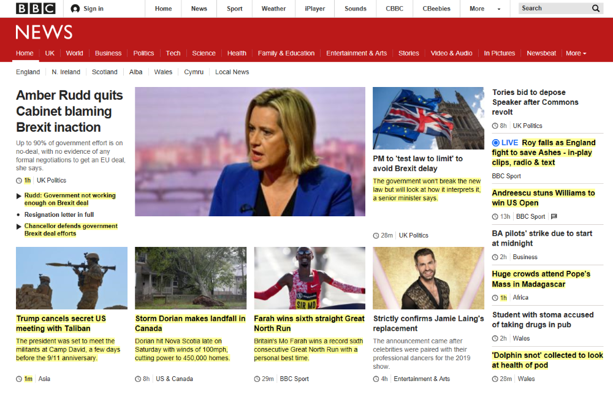

# HtmlTools
A collection of html tools, including:

* Filtering html (e.g. removing adverts and navigation panels)
* Converting html to text (whilst preservering some context and image data)
* Comparing html and highlighting changes.

An example showing changes highlighted in yellow:

